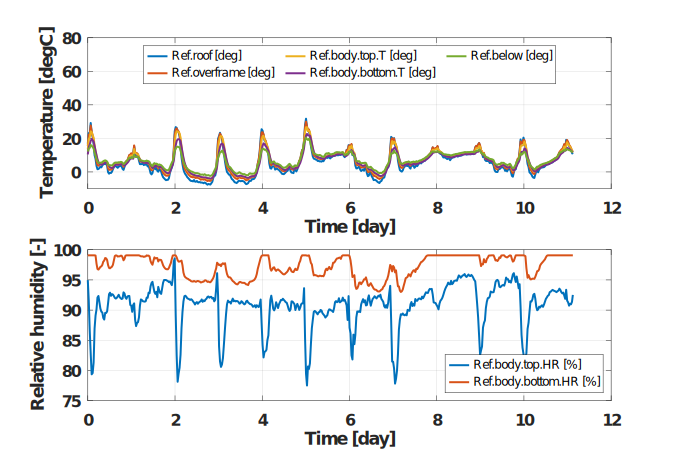
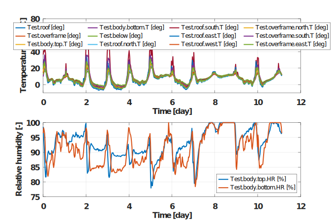
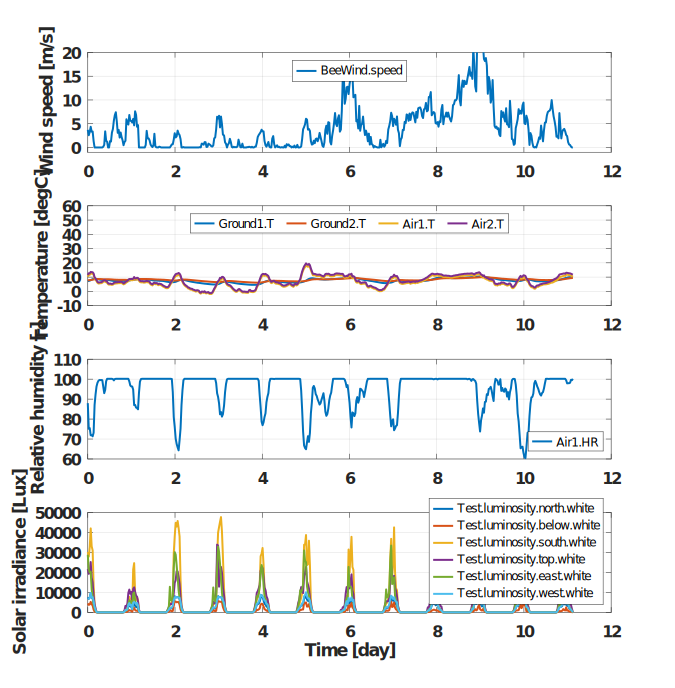

This directory contains measurements recorded in an experimental apiary near Bordeaux, France in december 2024.
The two zip files contains more or less the same data but in a different format. They contains 3 files:
1. for the reference Dadant hive
2. for the test Dadant hive
3. for the environment

The file "2024_12_23_TestHive_csv.zip" is optimized for memory usage since the resolution of float values were properly set and the acquisition period was reduced. The previous acquisition period of 1 minute is unnecessarily low. Moreover, the csv files contained in this archive are nearly compatible with [Binjr software](https://binjr.eu/). You have to remove all leading and trailing comments in the csv files. You may also have to remove the leading '#' of the line containing the name of each column.

Temperature and humidity values for the reference hive are shown here:

Temperature and humidity values for the test hive are shown here:

Temperature, humidity, solar irradiance, wind speed values for the environment hive are shown here:

