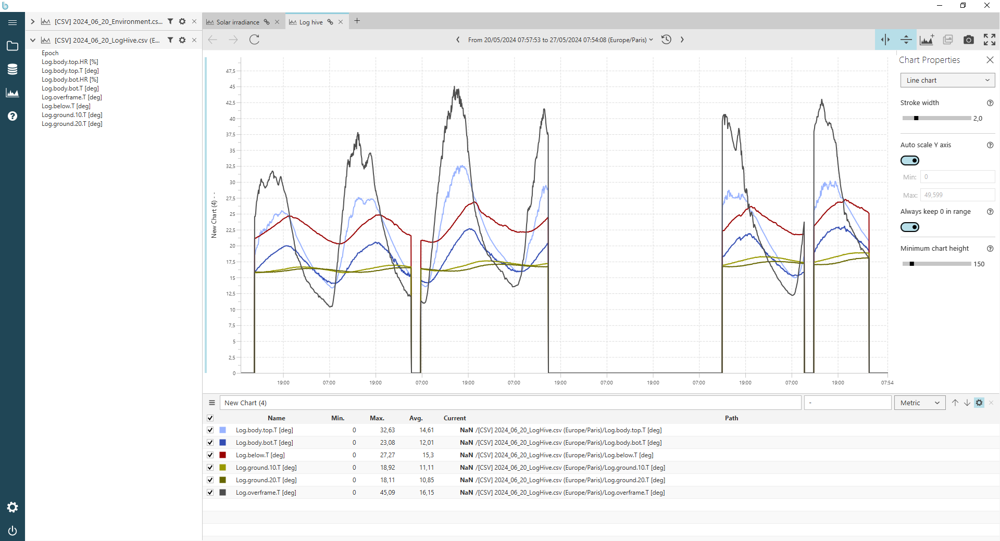

This directory contains measurements provided by an instrumented log hive in June 2024 near Saint-Hyppolyte-du-Fort (France).
This data can be used as input data for simulations or to analyse the thermal behavior of log hives.
However some issues were found with the outside air temperature. As a result, the timespan over which a simulation can be performed is very limited yet. For this purpose, you should use an other data series.

The format used by the csv data file is compatible with [Binjr software](https://binjr.eu/about/what_is_binjr/). Binjr is a time series browser; it renders time series data produced by other applications as dynamically editable representations and provides advanced features to navigate the data smoothly and efficiently.
The file extension .bjr refers to the Binjr file.

To save memory, all csv files are compressed using the zip format. The zip file must be decompressed before opening *.bjr file.
The image below gives an overview of the temperature measurements in this hive using Binjr software.

